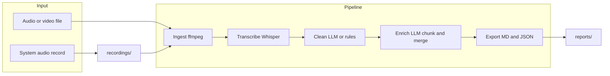

# MeetBrief

CLI tool that turns meeting audio/video into transcripts and structured summaries. Pipeline: ingest → transcribe (Whisper) → clean → enrich (LLM) → export to Markdown and JSON.



## Requirements

- Python 3.12+
- [ffmpeg](https://ffmpeg.org/download.html)
- OpenAI API key (`OPENAI_API_KEY`)

Optional for system audio recording:

- **Linux:** `pulseaudio-utils` or `pipewire-pulse`
- **macOS:** [BlackHole](https://github.com/ExistentialAudio/BlackHole) (recommended for isolating meeting app audio)

## Installation

```bash
git clone https://github.com/giorgosfatouros/meetbrief
cd meetbrief
uv sync
```

Load API key from environment or `.env`:

```bash
export OPENAI_API_KEY="your-api-key"
# or
echo "OPENAI_API_KEY=your-api-key" > .env
```

## Usage

### Full pipeline

```bash
meetbrief run meeting.mp4
```

Options: `--title`, `--language`, `--output-dir` (default `reports/`), `--timestamps` / `--no-timestamps`.

### Transcribe only

```bash
meetbrief transcribe meeting.mp4
```

### Summarize from transcript JSON

```bash
meetbrief summarize reports/2025-02-16-14-30-22/raw_transcript.json --title "Weekly Sync"
```

### Record system audio

Record from system audio (e.g. Zoom, Meet, Teams). Default: save under `recordings/` (git-ignored), then run the pipeline.

```bash
# Record until Ctrl+C, then process
meetbrief record --title "Team Meeting"

# Fixed duration (seconds)
meetbrief record --duration 60 --no-auto-process

# Custom output path
meetbrief record -o /path/to/meeting.wav

# List audio sources
meetbrief record --list-sources
```

| Option | Description |
|--------|-------------|
| `--output`, `-o` | Output file path (default: `recordings/recording_<timestamp>.wav`) |
| `--duration`, `-d` | Duration in seconds; omit to stop with Ctrl+C |
| `--title`, `-t` | Meeting title (for report) |
| `--language`, `-l` | Language code (e.g. `en`, `es`) |
| `--auto-process` / `--no-auto-process` | Run pipeline after recording (default: on) |
| `--source`, `-s` | Audio source (auto-detected if not set) |
| `--output-dir` | Report output directory when auto-processing (default: `reports/`) |

## Output layout

- **Recordings:** `recordings/recording_<YYYY-MM-DD-HH-MM-SS>.wav` (directory is git-ignored).
- **Reports:** under `reports/` (or `--output-dir`), in timestamped subfolders:

```
reports/
└── 2025-02-16-14-30-22/
    ├── raw_transcript.json
    ├── clean_transcript.md
    ├── report.md
    └── report.json
```

Report contents: title/date/duration, TL;DR, executive summary, decisions, action items (with owners/dates/priorities), risks and blockers, open questions. Clean transcript is in `clean_transcript.md` with segment timestamps.

## Pipeline

1. **Ingest** — Normalize input to 16 kHz mono WAV (ffmpeg).
2. **Transcribe** — OpenAI Whisper; segment timestamps, optional language hint.
3. **Clean** — LLM-based cleanup (GPT-4o-mini); fallback to rule-based if needed.
4. **Enrich** — Extract structure (summary, decisions, actions, risks, questions); meetings >20 min are chunked and merged.
5. **Export** — Markdown (Notion-friendly) and JSON.

Input: MP3, MP4, WAV, M4A (OpenAI limit 25 MB). Long meetings are chunked in ~20 min segments.

## Recording setup

### Linux (PulseAudio / PipeWire)

```bash
pactl info
meetbrief record --list-sources
```

If no monitor source appears: `pactl load-module module-loopback`. Install `pulseaudio-utils` or `pipewire-pulse` if needed.

### macOS

Install [BlackHole](https://github.com/ExistentialAudio/BlackHole), set system/output to BlackHole, then record from BlackHole in MeetBrief. Without it, recording uses default devices and may capture all system audio.

```bash
meetbrief record --list-sources
```

### Troubleshooting

- **No monitor sources (Linux):** `sudo apt install pulseaudio-utils` or `pipewire-pulse`; then `pactl load-module module-loopback`.
- **No devices (macOS):** `brew install ffmpeg`; consider BlackHole for isolation.
- **Poor quality:** Route meeting app to the selected source and check volume.

## Tech stack

- Python 3.12+, Typer (CLI), Rich (progress)
- ffmpeg (normalization), OpenAI Whisper (transcription), OpenAI GPT-4o-mini (clean + enrich)
- Pydantic (models), python-dotenv (env), uv (install), pytest (tests)

## Development

```bash
uv sync --extra dev
pytest
```

## Privacy and legal

- MeetBrief does not store recordings on its own servers; transcription and enrichment use the OpenAI API per your configuration.
- Obtain participant consent before recording; comply with local recording laws.

## License

MIT
